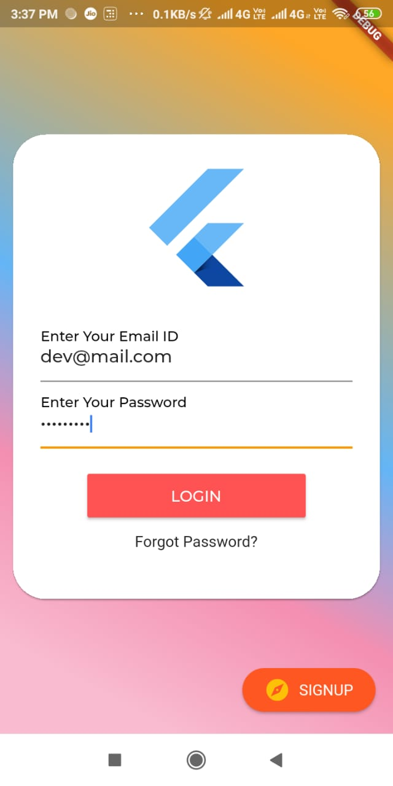

## Flutter socializing
    - App which will let flutter community to singup for different meetups or other such events.
    - These will be specific to the flutter community and will contain data from varies platforms like     meetup.com,getmeetingstar.com,groupvalley.com
    - takes feedback from users about the events
##Login

## View Events

## View Events Details

## FeedBack

## Team Members

- [Dhruvin Prajapati](https://github.com/dhruvinprajapati)
- [Devarsh Ranpura](https://github.com/DevarshRanpara)
- [Kishor Patel](https://github.com/kishorpatel85)
- [Bhavin Kalal]()
